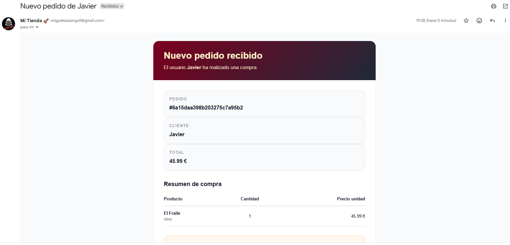

# 🍷 Vinoteca API - Documentació del Projecte

Aquest projecte és una plataforma per a la gestió d'una vinoteca i cerveseria, desenvolupada amb **Node.js, Express i MongoDB**. Permet la gestió de productes (vins i cerveses), comandes dels usuaris, control de rols d'usuaris (Usuari, Editor, Administrador), registre amb imatge de perfil i enviament de notificacions per correu electrònic.

---

## 🛠️ Arquitectura del Sistema

El projecte segueix una arquitectura de tipus **MVC (Model-Vista-Controlador)** adaptada per a una API REST:

```
vinoteca/
├── api/                  # Punt d'entrada per a Vercel (serveless)
│   └── [...path].js      # Reencaminament a app.js
├── config/               # Configuracions del sistema (Base de dades, Mailer)
│   ├── db.js             # Connexió i memòria cau de Mongoose (compatible amb serverless)
│   └── mailer.js         # Transportador de Nodemailer per a notificacions
├── controllers/          # Lògica de negoci de l'aplicació
│   ├── authController.js # Registre, login i hashing de contrasenyes
│   ├── cervezasController.js
│   ├── controladoresVinos.js
│   ├── pedidoController.js
│   └── userController.js
├── middlewares/          # Fils de seguretat i processament interceptor
│   ├── isAuth.js         # Verificació de tokens JWT
│   ├── isAdmin.js        # Verificació de rol Administrador
│   ├── isAdminOrEditor.js# Verificació de rol Administrador o Editor
│   └── upload.js         # Pujada d'imatges amb Multer (local o memòria per a Vercel)
├── models/               # Esquemes i models de dades de Mongoose (MongoDB)
│   ├── User.js           # Usuaris (nombre, email, password, foto, role)
│   ├── Pedido.js         # Comandes (user, productes: [productoId, cantidad, precioUnidad], total, estat)
│   ├── modelCerveza.js   # Cerveses (nom, graduació, tipus, descripció, preu, imatge, etc.)
│   └── modeloVino.js     # Vins (nom, any de fermentació, tipus, preu, imatge, etc.)
├── routes/               # Definició de rutes i mètodes HTTP de l'API
├── uploads/              # Carpeta de destí per a imatges locals (no s'utilitza a Vercel)
├── utils/                # Funcions auxiliars i utilitats
├── app.js                # Configuració principal d'Express i middlewares globals
├── package.json          # Dependències i scripts npm
└── vercel.json           # Configuració del desplegament a Vercel
```

---

## ⚙️ Variables d'Entorn (`.env`)

Crea un arxiu `.env` a la arrel del directori del projecte backend amb les següents variables:

```env
# Port del servidor (Per defecte 4000)
PORT=4000

# URI de connexió a la base de dades MongoDB (Local o MongoDB Atlas)
MONGO_URI=mongodb+srv://<usuari>:<contrasenya>@<cluster>.mongodb.net/<nom_db>?retryWrites=true&w=majority

# Clau secreta per a la firma i verificació dels tokens JWT
JWT_SECRET=la_teva_clau_secreta_super_segura

# Configuració de correu electrònic (Nodemailer)
MAILER_ENABLED=true
EMAIL_HOST=smtp.gmail.com
EMAIL_PORT=587
EMAIL_SECURE=false
EMAIL_USER=el_teu_correu@gmail.com
EMAIL_PASS=la_teva_contrasenya_d_aplicacio

# Correu on es rebran les notificacions de noves comandes (si no es posa, s'envia a EMAIL_USER)
EMAIL_NOTIFY_TO=destinatari_notificacions@gmail.com
```

---

## 🚀 Instal·lació i Execució

### Backend

1. **Instal·lar dependències**:
   ```bash
   npm install
   ```

2. **Executar en mode de desenvolupament**:
   ```bash
   npm run dev
   ```
   El servidor s'executarà a: `http://localhost:4000`

### Frontend (Si s'utilitza una aplicació client externa)

Normalment, si disposes d'un directori de frontend (com ara React, Vite o Next.js) en un directori adjacent o integrat:

1. **Navegar al directori del frontend**:
   ```bash
   cd ../frontend   # O el directori corresponent
   ```
2. **Instal·lar les dependències**:
   ```bash
   npm install
   ```
3. **Configurar el fitxer d'entorn client** (normalment `.env.local` o `.env`):
   ```env
   VITE_API_URL=http://localhost:4000/api
   # o per a Next.js:
   NEXT_PUBLIC_API_URL=http://localhost:4000/api
   ```
4. **Executar el servidor de desenvolupament frontend**:
   ```bash
   npm run dev      # O npm start
   ```

---

## 🌐 Endpoints de l'API

Tots els endpoints tenen com a prefix general `/api`.

### 1. Sistema de Salut (Health Check)
* **`GET /api/health`**
  * **Descripció**: Comprova l'estat del servidor backend.
  * **Accés**: Públic.
  * **Resposta d'èxit (200)**: `{ "ok": true, "message": "Backend funcionando" }`

---

### 2. Autenticació i Sessió (`/api/auth`, `/api/session` o `/api`)
* **`POST /register` / `/auth/register`**
  * **Descripció**: Registra un nou usuari. Suporta pujada de foto de perfil.
  * **Accés**: Públic.
  * **Tipus de contingut**: `multipart/form-data`
  * **Paràmetres del formulari**:
    * `nombre` (Text, Requerit)
    * `email` (Text, Requerit, Únic)
    * `password` (Text, Requerit)
    * `foto` (Arxiu d'imatge jpg/png/webp, Opcional)
  * **Resposta d'èxit (201)**: Retorna les dades de l'usuari creat (sense contrasenya) i el token JWT.

* **`POST /login` / `/auth/login`**
  * **Descripció**: Inicia sessió d'un usuari.
  * **Accés**: Públic.
  * **Tipus de contingut**: `application/json`
  * **Cos (Body)**:
    ```json
    {
      "email": "usuari@gmail.com",
      "password": "la_teva_contrasenya"
    }
    ```
  * **Resposta d'èxit (200)**: Retorna un objecte amb el token JWT i la informació bàsica de l'usuari (nom, email, rol, foto).

---

### 3. Gestió de Vins (`/api/vinos`)
* **`GET /api/vinos`**
  * **Descripció**: Obté la llista de tots els vins disponibles.
  * **Accés**: Públic.
  * **Resposta d'èxit (200)**: Array d'objectes de vins.

* **`GET /api/vinos/:id`**
  * **Descripció**: Obté la informació detallada d'un vi pel seu ID de MongoDB.
  * **Accés**: Públic.

* **`POST /api/vinos`**
  * **Descripció**: Crea un nou vi. Permet pujar una imatge per al producte.
  * **Accés**: Privat (Requereix Token JWT + Rol: `admin` o `editor`).
  * **Tipus de contingut**: `multipart/form-data`
  * **Paràmetres**: `nom` (req), `anioFermentacion` (req), `price` (req), `descripcio`, `tipus` ("Tinto", "Blanco", "Rosé", "Espumoso"), `stock`, `winery`, `region`, `country`, `imagen` (fitxer, opcional).

* **`PUT /api/vinos/:id`**
  * **Descripció**: Modifica les dades d'un vi existent.
  * **Accés**: Privat (Requereix Token JWT + Rol: `admin` o `editor`).
  * **Tipus de contingut**: `multipart/form-data` / `application/json`

* **`DELETE /api/vinos/:id`**
  * **Descripció**: Elimina un vi pel seu ID.
  * **Accés**: Privat (Requereix Token JWT + Rol: `admin` o `editor`).

---

### 4. Gestió de Cerveses (`/api/cervezas`)
* **`GET /api/cervezas`**
  * **Descripció**: Obté la llista de totes les cerveses disponibles.
  * **Accés**: Públic.

* **`GET /api/cervezas/:id`**
  * **Descripció**: Obté el detall d'una cervesa pel seu ID.
  * **Accés**: Públic.

* **`POST /api/cervezas`**
  * **Descripció**: Crea una nova cervesa. Permet afegir una imatge del producte.
  * **Accés**: Privat (Requereix Token JWT + Rol: `admin` o `editor`).
  * **Tipus de contingut**: `multipart/form-data`
  * **Paràmetres**: `nom` (req), `graduacio` (req), `price` (req), `tipus`, `descripcio`, `stock`, `imagen` (fitxer, opcional).

* **`PUT /api/cervezas/:id`**
  * **Descripció**: Modifica els detalls d'una cervesa existent.
  * **Accés**: Privat (Requereix Token JWT + Rol: `admin` o `editor`).

* **`DELETE /api/cervezas/:id`**
  * **Descripció**: Elimina una cervesa pel seu ID.
  * **Accés**: Privat (Requereix Token JWT + Rol: `admin` o `editor`).

---

### 5. Gestió de Comandes (`/api/pedidos`)
* **`POST /api/pedidos`**
  * **Descripció**: Crea una nova comanda de compra. Envia automàticament un correu de notificació amb el detall de la compra si el mailer està habilitat.
  * **Accés**: Privat (Requereix Token JWT de qualsevol usuari loguejat).
  * **Tipus de contingut**: `application/json`
  * **Cos (Body)**:
    ```json
    {
      "user": "ID_DE_L_USUARI",
      "productos": [
        {
          "productoId": "ID_DEL_VI_O_CERVESA",
          "productoModelo": "Vino", // o "Cerveza"
          "cantidad": 2,
          "precioUnidad": 19.95
        }
      ],
      "total": 39.90
    }
    ```

* **`GET /api/pedidos/mis-pedidos`**
  * **Descripció**: Llista les comandes realitzades per l'usuari autenticat actual.
  * **Accés**: Privat (Requereix Token JWT del propi usuari).

---

### 6. Gestió d'Usuaris (`/api/users`)
* **`GET /api/users`**
  * **Descripció**: Llista tots els usuaris registrats al sistema.
  * **Accés**: Privat (Requereix Token JWT + Rol: `admin`).

* **`PATCH /api/users/:id/role`**
  * **Descripció**: Actualitza el rol d'un usuari.
  * **Accés**: Privat (Requereix Token JWT + Rol: `admin`).
  * **Cos (Body)**:
    ```json
    {
      "role": "admin" // o "editor" o "user"
    }
    ```

* **`DELETE /api/users/:id`**
  * **Descripció**: Elimina un compte d'usuari del sistema.
  * **Accés**: Privat (Requereix Token JWT + Rol: `admin`).

## Imagen pedido
